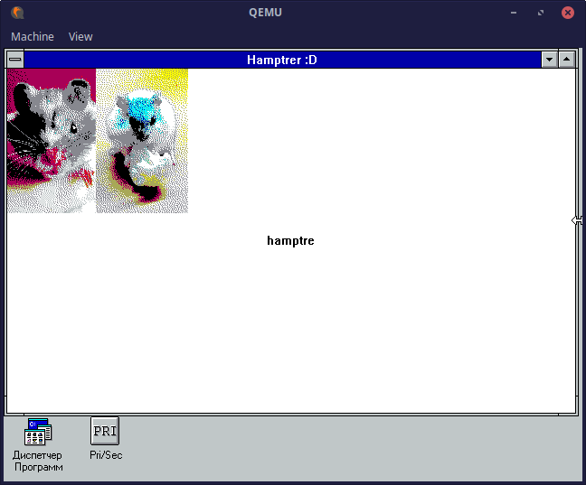

# Windows 3.11 C/C++ Playground

[Русская версия](./ПРОЧТИ%20МЕНЯ.md)

*Code for this program is located in [`projects/snowball`](./projects/snowball)*

## Installing

### Windows

Download PowerShell 7 or newer either from WinGet, Microsoft Store or [Microsoft website (.msi)](https://docs.microsoft.com/en-us/powershell/scripting/install/installing-powershell-on-windows?view=powershell-7.2#msi).

### Linux

Install `powershell` from the Microsoft repos, `qemu-system-i386` and `dosbox` from somewhere else.

## How to make a new project

Make a copy of `example` folder in `projects` and rename it to something you like. Now you can add as many `.c`/`.cpp`/`.h` files as you like!

## How to build

 1. Open PowerShell console in this folder (you can use a regular shell on Linux)
 2. `./build.ps1 -project name-of-the-project`, for example, the `example` project in `projects` folder is built with the following command: `./build.ps1 -project example`

Script automagically compiles and links your project's files, names the executable as `project-name.exe` and runs Windows 3.11 with your program in autorun.

## How to clean up

Feel free to remove every `.o` file you see! Other unnecessary files are listed in [.gitignore](./.gitignore)

## What's in this repo

 1. Open Watcom 2.0
 2. QEMU
 3. DOSBox

## What's in the Windows image

 1. MS-DOS 6.22
 2. Windows for Workgroups 3.11
 3. [vmwmouse](https://github.com/NattyNarwhal/vmwmouse) mouse driver

## Known issues

 1. The screen of QEMU is filled with static!

It probably happens because of the mouse driver. Wait until the static no longer changes, then try forcing OS to redraw the windows by dragging them around.

## Documentation

Knowledge base with the docs for old Windows API: [https://github.com/jeffpar/kbarchive](https://github.com/jeffpar/kbarchive)
